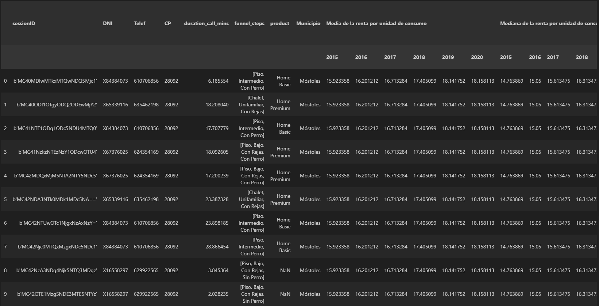

# ETL
The top-level repo structure is the following:
```
.
├── data                # Project data, both input and output
├── images              # Images for `readme.md` file
├── notebooks           # Jupyter Notebooks for interactive development  
├── src                 # Python ETL script
├── readme.md                  
└── requirements.txt    # Pyhton dependencies
```
## ETL code
See [`./src/etl.py`](./src/etl.py) script for the ETL source code.

## Output file sample
The ETL script generates an output file [`./data/output/out_data.csv`](./data/output/out_data.csv). Check the [`./notebooks/eda.ipynb`](./notebooks/eda.ipynb) notebook, or see the image below for a sample of the output data.



## About the ETL process

### About the crimes data
When dealing with the crimes data CSV, I have assumed it has a hierarchical index.

After reading the file, one can see its principal pathology is a faulty data integrity, meaning it's not fully structured but contains metadata and footnotes. In addition, it has some empty columns.

To deal with the previous data pathologies, I have left out the first 4 rows, then used the following two as headers and skipped the last 7. Moreover, I have dropped the last column and removed the numbering from the column names and the `-Municipio de ` prefix from the municipality name.

### Regarding the income data
Working with the income data, I have assumed that:
- `Total` column is the value of the given metric, so it should be numeric, and
- `Municipios` column is a combination of the zip code and the municipality name.

The principal data pathologies are missing values, particularly in the `Secciones` and `Distritos` columns, and inconsistent values in the `Total` column.

After loading the data, I have casted the `Total` column to numeric, and I have extracted to zip code and municipality name from the `Municipios` column using regular expressions.

### On the call center data
The assumptions about the call center data are that
- it corresponds to some events table hence the `DNI`, `Telef`, `CP` and `duration_call_mins` columns have the same value for a given `sessionID`, and 
- the session ID should not be null, and if it is the corresponding data could not be reliable.

The most important data pathology this dataset has are missing values: a few on the `sessionID` and several in the `Producto` one.

According to the assumptions below, I have grouped the data by the `DNI`, `Telef`, `CP`, `duration_call_mins` and `sessionID` columns -dropping those with missing values on any of them- and aggregated the remaining ones by listing them. Then, to ease the forthcoming joining process, I have created a dummy column multi-index.

### Merging them all
After loading and transforming the inputs files as descripted above, I have created a temporary dataframe by joining the income and crimes data based on the municipality name and added the call center data, merging it according to the zip code. Assuming the final dataset must contain data from all three sources, I have used inner joins.


